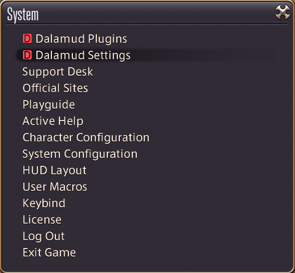
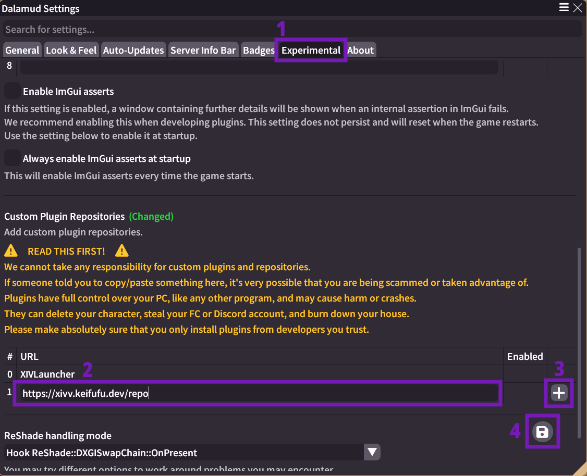
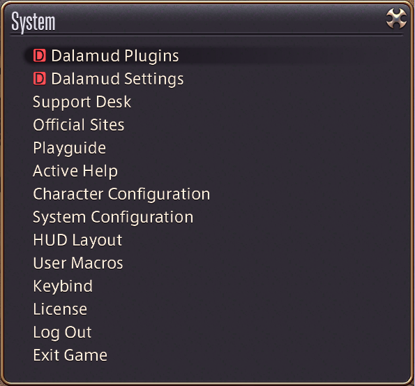
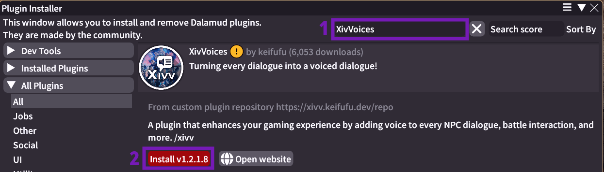

<p align="center"></p>
<p align="center"></p>

<h3 align="center">Transforming Final Fantasy XIV by voicing every piece of dialogue!</h3>

<br />

## Description

**XivVoices** is a plugin for Final Fantasy XIV that voices every NPC dialogue, battle interaction, and more. This plugin not only voices dialogues but also syncs NPC lip movements for an immersive experience. Immerse yourself in main and side quests alike, with every dialogue voiced, whether from named or unnamed NPCs.

### Social

Issues? Kudos? Wanna just hang with fellow FFXIV Story enjoyers?
[Join us on Discord!](https://xivv.keifufu.dev/discord)

### Key Features:

1. **Expansive Coverage**: Voices all in-game dialogue, including NPC conversations, battle dialogue, narrator lines, and more.
2. **Lip Syncing**: Syncs NPCs' lip movements with their voiced dialogues for enhanced realism.
3. **Player Chat**: Implements voices for player messages using local TTS.
4. **Report System**: Every missing piece of dialogue gets reported automatically to be processed shortly after. Users can also manually report any dialogue they think should be redone for better quality.
5. **Always Voiced**: When a line isn't yet voiced, the plugin falls back to local TTS, the same used for chat messages.
6. **Customization**: We provide plenty of settings to customize what you want voiced and how!

### Requirements

- Approximately 8GB of free storage space.
- XIVLauncher with Dalamud installed.

## Installation Guide

Follow these steps to install XivVoices:

1. **Prepare Your System**:
   - Ensure that XIVLauncher is installed on your system along with Dalamud.
2. **Configure Dalamud**:
   - Navigate to the System menu in the game, then to Dalamud Settings.
   - In the "Experimental" tab under "Custom Plugin Repositories", add the XivVoices Plugin Repo:
     ```
     https://xivv.keifufu.dev/repo
     ```
   - Use the images below for guidance:
     - 
     - 
3. **Install the Plugin**:
   - Open the Dalamud Plugins window.
   - Navigate to 'All Plugins', search for "XivVoices", and click 'Install'.
     - 
     - 
4. **Setup Plugin**:
   - Upon first launch, you'll be prompted with a setup screen to select a storage location for the plugin’s content.
   - After selecting the appropriate drive or directory, click "Install".
     - 
