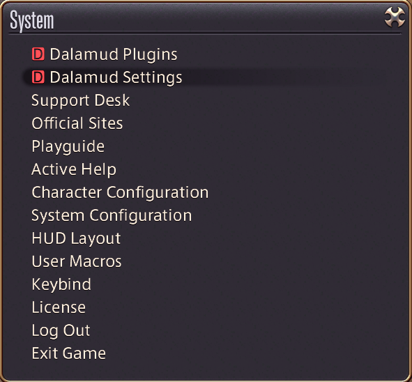
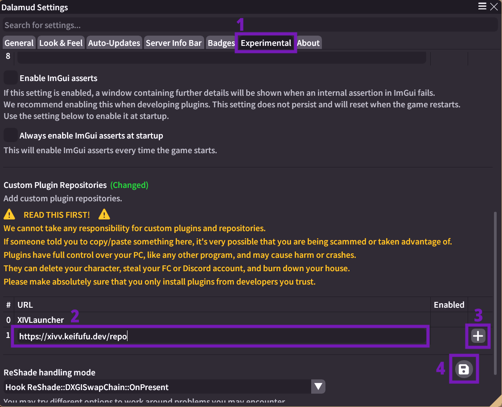
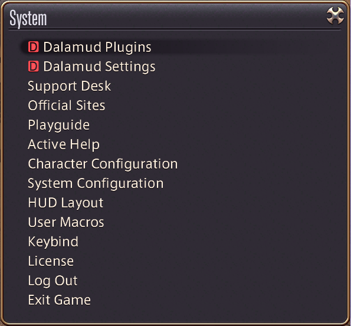
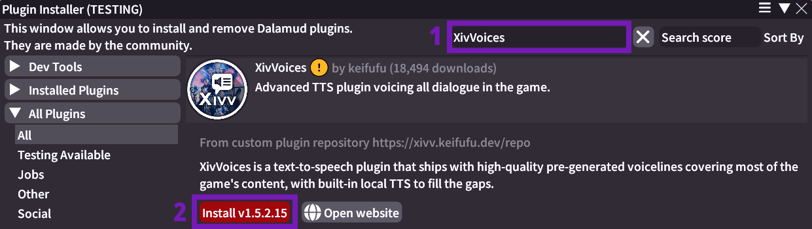
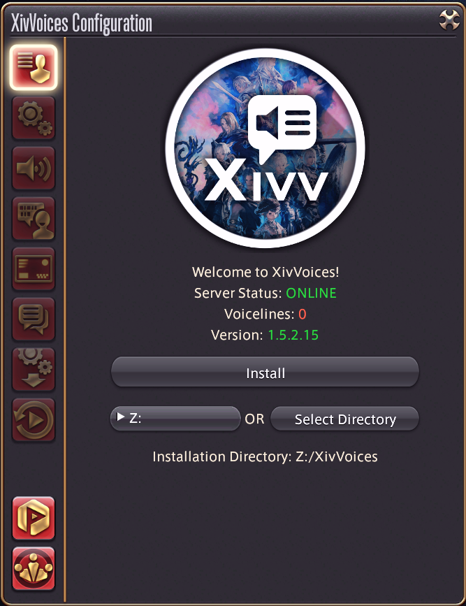

<p align="center"></p>
<p align="center"></p>

<h3 align="center">Advanced TTS plugin voicing all dialogue in the game.</h3>

<br />

## Description

**XivVoices** is a text-to-speech plugin that ships with high-quality pre-generated voicelines covering most of the game's content, with built-in local TTS to fill the gaps.

### Key Features:

1. **Expansive Coverage**: Voices all in-game dialogue, including NPC conversations, battle dialogue, narrator lines, and more.
2. **Report System**: Every missing piece of dialogue gets reported automatically to be processed shortly after. Users can also manually report any dialogue they think should be redone for better quality.
3. **Always Voiced**: When a line isn't yet generated, the plugin falls back to local TTS.
4. **Local TTS**: Built-in local TTS with multiple voices and many options such as voice and pitch overrides, and a lexicon to tweak pronunciation.
5. **Player Chat**: Chat messages and player choices are voiced using local TTS.
6. **QoL Features**: Auto-advance, lip syncing, dialogue queueing, and more.
7. **Highly Configurable**: There are plenty of settings to customize what you want voiced and how.
8. **Cross Platform**: Works on all operating systems out of the box.

### Requirements

- Approximately 8GB of free storage space.
- XIVLauncher with Dalamud installed.

## Installation Guide

Follow these steps to install XivVoices:

1. **Prepare Your System**:
   - Ensure that XIVLauncher is installed on your system along with Dalamud.
2. **Configure Dalamud**:
   - Navigate to the System menu in the game, then to Dalamud Settings.
   - In the "Experimental" tab under "Custom Plugin Repositories", add the XivVoices Plugin Repo:
     ```
     https://xivv.keifufu.dev/repo
     ```
   - Use the images below for guidance:
     - 
     - 
3. **Install the Plugin**:
   - Open the Dalamud Plugins window.
   - Navigate to 'All Plugins', search for "XivVoices", and click 'Install'.
     - 
     - 
4. **Setup Plugin**:
   - Upon first launch, you'll be prompted with a setup screen to select a storage location for the plugin’s content.
   - After selecting the appropriate drive or directory, click "Install".
     - 

### Social

Issues? Kudos? Wanna just hang with fellow FFXIV Story enjoyers?
[Join us on Discord!](https://xivv.keifufu.dev/discord)

Want to support XivVoices?
[Support us on Patreon!](https://xivv.keifufu.dev/patreon)

We also have a website for Stats and Leaderboards, if that tickles your fancy. [xivv.keifufu.dev](https://xivv.keifufu.dev)
